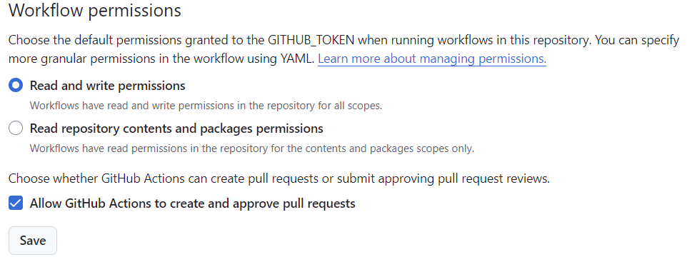

# Update Your README

This project automatically updates README files based on changes in pull requests using GitHub API and language models.

## Features

- Suggests README updates based on 1) the pull request description 2) the code changes in the PR 3) commit messages
- Automatically closes stale README update PRs
- Uses LangChain and Anthropic's Claude model, OpenAI's models, or GitHub models for intelligent suggestions
- Option to skip README checks for testing purposes

Currently only available for developers of this repo:
- If you comment on a README PR, it will regenerate the README using your feedback

## Usage

### Prerequisites:

- GitHub repository
- Anthropic API key, OpenAI API key, or GitHub Personal Access Token (PAT)

To use this action in your GitHub workflow, add the following step to your `.github/workflows/your-workflow.yml` file, replacing the version as needed:

```yaml
- uses: ktrnka/update-your-readme@VERSION
  with:
    model-provider: "openai"
    api-key: ${{ secrets.OPENAI_API_KEY }}
    model: gpt-4o-mini-2024-07-18  # Specify your preferred model
    readme-file: README.md
    debug: "true"
```

See `.github/workflows/suggest_readme_updates.yml` for an example.

Make sure to set an API key such as `ANTHROPIC_API_KEY`, `OPENAI_API_KEY`, or `GH_PAT` secret in your repository settings. Note: The Action will not work on PRs from forks because these secrets aren't available on workflows for those PRs.

### Model Configuration

You can specify which model to use through the `model-provider` and `model` input parameters. This allows you to choose between Anthropic, OpenAI, and GitHub models:
- For Anthropic:
  - `claude-3-5-sonnet-20240620` (default) - Recommended for quality
  - `claude-3-5-haiku-latest` - Faster and more cost-effective option.
- For OpenAI:
  - `gpt-4o-mini-2024-07-18` - Example of an OpenAI model
- For GitHub:
  - `gpt-4o` - Example of a GitHub model
  - `gpt-4o-mini` - Another GitHub model option

In your repo settings, under Actions > General > Workflow Permissions be sure to check "Allow GitHub Actions to create and approve pull requests" and allow read/write from Github Actions:


### Installation and Setup

To set up the project, you need to install the 'uv' package for managing the Python environment:

1. Install uv:
   ```
   make install-uv
   ```

2. Install dependencies:
   ```
   make install
   ```

### Skipping README Check

To skip the README check for testing purposes, include "NO README REVIEW" in the pull request body. This will cause the action to exit without performing any updates.

### Handling README Paths

The action now supports specifying both relative and absolute paths for the README file. Use the following input parameters in your workflow configuration:

- `readme-relative`: The path to the README file relative to the repository root (required).
- `readme-absolute`: The absolute path to the README file (required).

Example:

```yaml
- uses: ktrnka/update-your-readme@VERSION
  with:
    model-provider: "openai"
    api-key: ${{ secrets.OPENAI_API_KEY }}
    model: gpt-4o-mini-2024-07-18
    readme-relative: README.md
    readme-absolute: ${{ github.workspace }}/README.md
    debug: "true"
```

## Development

### Testing

This project uses pytest for testing. To run the tests, execute the following command:

```
make test
```

### Code Formatting

We use Black for code formatting. To format your code, run:

```
black .
```

### Contributing

Contributions are welcome! Please feel free to submit a Pull Request.

1. Ensure your code follows the project's coding standards (use Black for formatting).
2. Update the README if necessary.

### License

[MIT License](https://opensource.org/licenses/MIT)

### GitHub Actions Integration

This project includes GitHub Actions workflows that enhance the README update process:

1. **Suggest README Updates**: Defined in `.github/workflows/suggest_readme_updates.yml`, this workflow:
   - Uses the `ktrnka/update-your-readme` action
   - Runs the README update process
   - Creates a new pull request with the suggested changes
   - Adds a comment to the original pull request with a link to the suggested changes

2. **Close Stale PRs**: Defined in `.github/workflows/close_stale_prs.yml`, this workflow:
   - Runs on a daily schedule
   - Uses the `actions/stale@v9` action to automatically close stale pull requests
   - Configurable stale and close timeframes
   - Targets PRs with the "update-your-readme" label

3. **README Feedback**: Defined in `.github/workflows/readme_feedback.yml`, this workflow:
   - Handles feedback on README updates

To use these features, ensure that your repository has the necessary secrets set up (`ANTHROPIC_API_KEY`, `OPENAI_API_KEY`, or `GH_PAT`) and pass them as parameters to the action.

### Debugging

The action supports a `debug` input, which can be set to "true" to enable additional debugging information. This can be helpful when troubleshooting issues with the action.